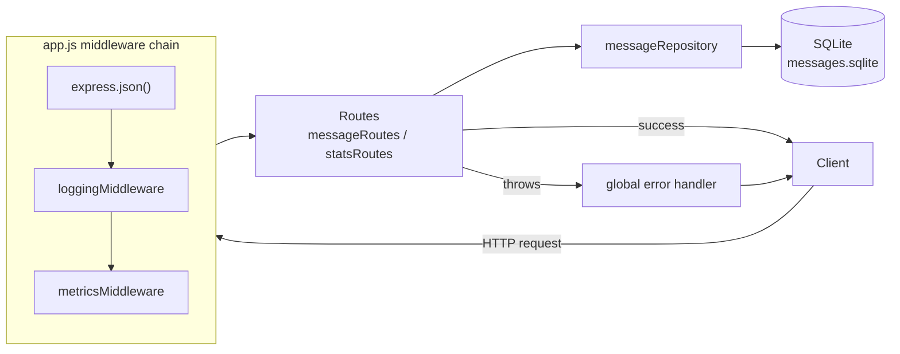

# Message API

A small but production-minded messaging API built as a technical assignment.

## Overview

This API stores and manages short text messages. It exposes REST endpoints for creating, reading, listing, deleting, and resetting messages, plus basic operational statistics.

The service is intentionally small: it runs with Node.js, stores data in SQLite, and does not require an external database or extra infrastructure.

## Requirements

- Node.js 22+
- npm

Docker is optional.

## Running Locally

```bash
npm install
npm start
```

The API starts on port `3000` by default.

Optional environment variables:

- `PORT`: defaults to `3000`
- `DATABASE_PATH`: defaults to `messages.sqlite`

## Running With Docker

```bash
docker build -t message-api .
docker run --rm -p 3000:3000 message-api
```

Docker is optional. The API can also run directly with Node.js.

## Running Tests

```bash
npm test
```

The test suite uses Jest and Supertest with an in-memory SQLite database.

## Endpoints

### Health Check

`GET /health`

Status: `200 OK`

```json
{ "status": "ok" }
```

### Create Message

`POST /messages`

Request body:

```json
{ "message": "Hello world" }
```

Validation rules:

- Message is required.
- Leading and trailing whitespace is trimmed before validation and storage, so length checks apply to the trimmed message.
- Message must be at least 5 characters.
- Message must be at most 200 characters.
- Message must contain at least one alphanumeric character.
- Message must not duplicate an existing stored message.

Success response — `201 Created`:

```json
{
  "id": 1,
  "message": "Hello world",
  "createdAt": "2026-07-20T12:00:00.000Z"
}
```

Validation error — `400 Bad Request`:

```json
{ "error": "Message must be at least 5 characters" }
```

Duplicate message — `409 Conflict`:

```json
{ "error": "Message already exists" }
```

Unexpected failure — `500 Internal Server Error`:

```json
{ "error": "Could not create message" }
```

### List Messages

`GET /messages`

Optional query parameters:

- `page`: page number, defaults to `1`
- `limit`: page size, defaults to `20`, maximum `100`
- `query`: filters messages using a partial text match
- `createdSince`: filters messages created from a date or datetime

Examples:

```http
GET /messages?page=1&limit=20
GET /messages?page=1&limit=20&query=hello
GET /messages?page=1&limit=20&createdSince=2026-07-20
GET /messages?page=1&limit=20&createdSince=2026-07-20T10:30:00.000Z
```

Success response — `200 OK`:

```json
{
  "data": [
    {
      "id": 1,
      "message": "Hello world",
      "createdAt": "2026-07-20T12:00:00.000Z"
    }
  ],
  "pagination": {
    "page": 1,
    "limit": 20,
    "total": 1
  }
}
```

Invalid query parameter — `400 Bad Request`:

```json
{ "error": "Limit must be between 1 and 100" }
```

### Get Message By ID

`GET /messages/:id`

Success response — `200 OK`:

```json
{
  "id": 1,
  "message": "Hello world",
  "createdAt": "2026-07-20T12:00:00.000Z"
}
```

Not found — `404 Not Found`:

```json
{ "error": "Message not found" }
```

### Delete Message By ID

`DELETE /messages/:id`

Success response: `204 No Content` (empty body).

Not found — `404 Not Found`:

```json
{ "error": "Message not found" }
```

### Reset Messages

`DELETE /messages`

Deletes all stored messages.

Success response: `204 No Content` (empty body).

## Statistics

These endpoints exist to support operations: capacity planning, spotting misbehaving clients, and confirming the service is healthy after a deploy.

### Message Stats

`GET /stats/messages`

Status: `200 OK`

Purpose: tracks storage growth (`totalStored`, useful for capacity planning) and the ratio of valid to invalid submissions (`submissions`, useful for spotting client-side bugs or misuse — a spike in `invalid` usually means a caller is sending malformed data).

```json
{
  "totalStored": 10,
  "submissions": {
    "valid": 8,
    "invalid": 2
  }
}
```

### Request Stats

`GET /stats/requests`

Status: `200 OK`

Purpose: shows overall traffic volume and its breakdown by endpoint (`byType`), which helps identify which operations drive load and informs capacity/scaling decisions.

```json
{
  "total": 25,
  "byType": {
    "GET /health": 5,
    "POST /messages": 10,
    "GET /messages": 8,
    "DELETE /messages/:id": 2
  }
}
```

### Response Stats

`GET /stats/responses`

Status: `200 OK`

Purpose: surfaces API health through the distribution of status codes. A rising share of `4xx` responses points to bad client input or usage patterns; a rising share of `5xx` points to server-side problems that need investigation.

```json
{
  "total": 25,
  "byStatusCode": {
    "200": 12,
    "201": 8,
    "400": 3,
    "404": 1,
    "409": 1
  }
}
```

### Service Stats

`GET /stats/service`

Status: `200 OK`

Purpose: reports how long the process has been running (`uptimeSeconds`), which is useful for confirming a deploy or restart happened and for basic liveness checks.

```json
{ "uptimeSeconds": 120 }
```

## Data Model

Messages are stored in SQLite with this shape:

```text
id          INTEGER PRIMARY KEY AUTOINCREMENT
message     TEXT NOT NULL UNIQUE
created_at  TEXT NOT NULL
```

API responses expose `created_at` as `createdAt`.

## Architecture

### Technology Stack

- **Runtime:** Node.js (ES modules)
- **Web framework:** Express 5 — minimal setup and a well-known surface for a small REST API
- **Database:** SQLite via the `sqlite3` driver — a single embedded file, no separate database server to install or configure
- **Testing:** Jest + Supertest — integration tests that exercise the app over HTTP against an in-memory SQLite database
- **Logging:** a small hand-rolled structured logger ([src/logging/logger.js](src/logging/logger.js)) that writes JSON lines to stdout, avoiding an external logging dependency at this scale
- **Metrics:** an in-memory counters module ([src/metrics/metricsStore.js](src/metrics/metricsStore.js)), avoiding an external metrics backend at this scale

### Project Structure

```text
src/
  app.js                    Express app: middleware wiring, routes, global error handler
  server.js                 process entrypoint: boots the database, starts listening
  routes/
    messageRoutes.js        /messages endpoints: validation and HTTP concerns
    statsRoutes.js          /stats endpoints
  repositories/
    messageRepository.js    all SQL for messages, isolated from the HTTP layer
  persistence/
    database.js             SQLite connection and schema setup
  middleware/
    loggingMiddleware.js    structured request logging
    metricsMiddleware.js    in-memory request/response counters
  metrics/
    metricsStore.js         metrics state and accessors
  logging/
    logger.js               structured JSON logger
```

### Layering & Request Flow

Each layer has one responsibility, and requests only flow downward:

1. **Routes** (`routes/`) own HTTP concerns — parsing query params, validating input, choosing status codes, shaping the response body. They never touch SQLite directly.
2. **Repositories** (`repositories/`) hold all SQL. Routes call repository functions and get back plain JS values, which keeps query logic out of the HTTP layer and in one place per entity.
3. **Persistence** (`persistence/database.js`) owns the raw SQLite connection and schema creation.
4. Cross-cutting concerns — request logging, in-memory metrics, and error handling — are implemented once as Express middleware and a single global error handler in `app.js`, instead of being repeated inside each route.



## Logging

The service writes structured JSON logs (one line per event) to stdout, so they can be collected by any container log driver or log aggregator without extra configuration.

- Every request logs a `request completed` event with method, path, status code, and duration.
- Unhandled errors (including malformed JSON bodies), uncaught exceptions, and unhandled promise rejections are logged with the error message and stack trace before the process responds or exits.

## Design Notes

- The API is RESTful and uses JSON request/response bodies.
- SQLite keeps setup portable and avoids requiring an external database.
- The database table is created automatically when the service starts.
- Message IDs are generated by SQLite using an autoincrementing integer primary key.
- Messages are hard-deleted because no audit or recovery requirement was specified.
- Request and response statistics are kept in memory and reset when the service restarts.
- Message totals are read from SQLite so they reflect the current stored data.

## Assumptions & Trade-offs

- **No authentication or authorization.** The assignment describes an internal tool, so the API is left open. In a real deployment it would sit behind a gateway or API keys before being exposed beyond a trusted network.
- **In-memory metrics, not persisted.** Request/response/submission counters live in process memory instead of a time-series store. This avoids extra infrastructure and matches "persistence beyond runtime is not required," but it means counters reset on restart and don't aggregate across multiple instances — a multi-instance deployment would need a shared backend (e.g., Prometheus scraping each instance, or a push-based store).
- **SQLite as a single file.** Chosen for zero-setup portability, not for production scale. It's fine for a single instance, but concurrent writes across multiple processes/instances aren't its strength; the repository layer isolates all SQL, so swapping in Postgres/MySQL later is a contained change.
- **Duplicate detection is check-then-insert, not fully atomic.** The API queries for an existing message before inserting, then falls back to the database's `UNIQUE` constraint (mapped to `409 Conflict`) as a safety net if two requests race each other.
- **Hard delete, no soft delete/versioning.** Deleted messages are unrecoverable. Acceptable here since no audit/recovery requirement was specified; a production system handling user data might prefer soft deletes.
